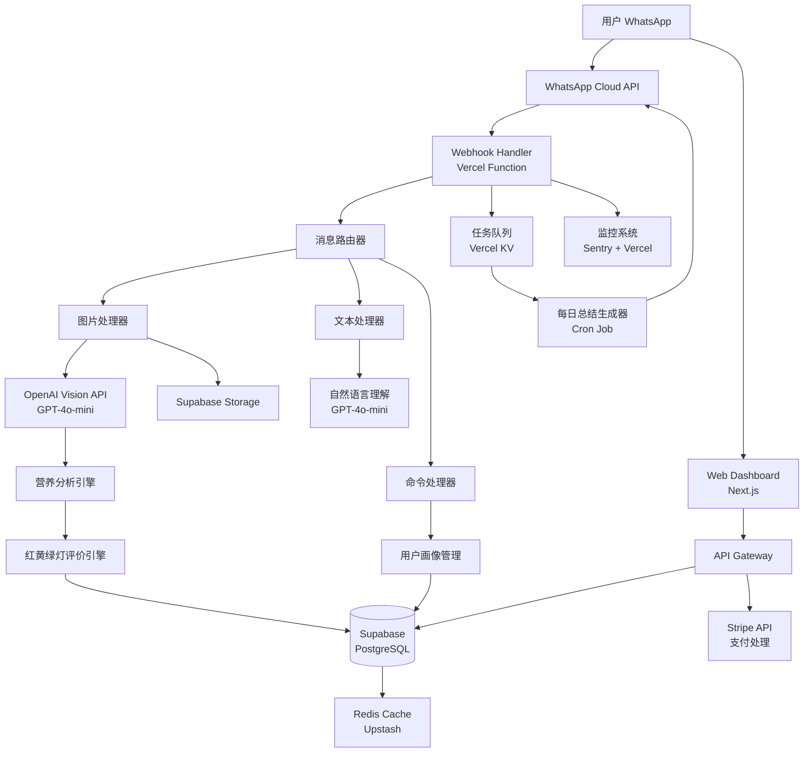

# 设计文档：Vita AI

## 概述

Vita AI 是一个基于 WhatsApp 的智能健康饮食助手，专为新加坡市场设计。系统采用 Serverless 架构，通过多模态 AI API 实现食物识别和营养分析，无需自训练模型。

### 核心设计原则

1. **API 优先**: 使用现成的 AI API（GPT-4o-mini、Claude 等），不涉及模型训练
2. **Serverless 架构**: 使用云函数和托管服务，降低运维成本
3. **用户体验至上**: 零摩擦启动、快速响应、智能化交互
4. **成本可控**: 智能缓存、模型选择、成本监控
5. **本地化优先**: 针对新加坡食物和文化优化

### 技术栈选择

- **WhatsApp 集成**: WhatsApp Cloud API（官方推荐，免费额度高）
- **后端**: Node.js + TypeScript（Vercel Functions 或 AWS Lambda）
- **数据库**: Supabase（PostgreSQL + 实时订阅 + 认证）
- **AI 服务**: OpenAI GPT-4o-mini（视觉识别）+ GPT-4o（复杂任务）
- **支付**: Stripe（支持 PayNow）
- **前端**: Next.js + React（Web Dashboard）
- **图片存储**: Supabase Storage 或 AWS S3
- **监控**: Sentry（错误追踪）+ Vercel Analytics


## 架构

### 系统架构图



### 架构说明

#### 消息流程
1. 用户通过 WhatsApp 发送消息/图片
2. WhatsApp Cloud API 触发 Webhook（Vercel Function）
3. 消息路由器根据类型分发到对应处理器
4. 处理器调用 AI API 或业务逻辑
5. 结果存储到数据库并返回给用户

#### 关键设计决策

**为什么选择 Vercel Functions？**
- 零配置部署，自动扩展
- 免费额度充足（100GB-hours/月）
- 与 Next.js 无缝集成
- 全球 CDN 加速

**为什么选择 Supabase？**
- PostgreSQL + 实时订阅 + 认证一体化
- 免费额度：500MB 数据库 + 1GB 存储
- Row Level Security（RLS）保护数据
- 自动生成 REST API

**为什么选择 GPT-4o-mini？**
- 成本低（$0.15/1M input tokens）
- 支持视觉识别
- 响应速度快（< 3 秒）
- 足够准确（85%+ 识别率）


## 组件和接口

### 1. WhatsApp Webhook Handler

**职责**: 接收和验证 WhatsApp 消息

```typescript
interface WebhookPayload {
  object: string;
  entry: Array<{
    id: string;
    changes: Array<{
      value: {
        messaging_product: string;
        metadata: { phone_number_id: string };
        messages?: Message[];
        statuses?: Status[];
      };
    }>;
  }>;
}

interface Message {
  from: string;  // 用户手机号
  id: string;    // 消息 ID
  timestamp: string;
  type: 'text' | 'image' | 'interactive';
  text?: { body: string };
  image?: { id: string; mime_type: string; sha256: string };
  interactive?: InteractiveMessage;
}

class WebhookHandler {
  async handleWebhook(payload: WebhookPayload): Promise<void>;
  async verifyWebhook(token: string): Promise<boolean>;
  async downloadMedia(mediaId: string): Promise<Buffer>;
}
```

### 2. 消息路由器

**职责**: 根据消息类型分发到对应处理器

```typescript
interface MessageContext {
  userId: string;
  messageId: string;
  timestamp: Date;
  language: 'en' | 'zh-CN' | 'zh-TW';
}

class MessageRouter {
  async route(message: Message, context: MessageContext): Promise<void> {
    if (message.type === 'image') {
      await this.imageHandler.handle(message, context);
    } else if (message.type === 'text') {
      await this.textHandler.handle(message, context);
    } else if (message.type === 'interactive') {
      await this.interactiveHandler.handle(message, context);
    }
  }
}
```


### 3. 图片处理器和食物识别

**职责**: 处理食物图片，调用 Vision API 识别

```typescript
interface FoodRecognitionResult {
  foods: Array<{
    name: string;
    nameLocal: string;  // 本地化名称
    confidence: number;  // 0-100
    portion: string;     // 份量描述
    nutrition: NutritionData;
  }>;
  totalNutrition: NutritionData;
  mealContext: 'breakfast' | 'lunch' | 'dinner' | 'snack';
}

interface NutritionData {
  calories: { min: number; max: number };
  protein: { min: number; max: number };
  carbs: { min: number; max: number };
  fat: { min: number; max: number };
  sodium: { min: number; max: number };
}

class ImageHandler {
  async handle(message: Message, context: MessageContext): Promise<void> {
    // 1. 下载图片
    const imageBuffer = await this.downloadImage(message.image.id);
    
    // 2. 检查配额
    await this.checkQuota(context.userId);
    
    // 3. 调用 Vision API
    const result = await this.recognizeFood(imageBuffer, context);
    
    // 4. 生成评价
    const rating = await this.ratingEngine.evaluate(result, context.userId);
    
    // 5. 保存记录
    await this.saveRecord(context.userId, result, rating);
    
    // 6. 返回结果
    await this.sendResponse(context.userId, result, rating);
  }
  
  private async recognizeFood(
    image: Buffer, 
    context: MessageContext
  ): Promise<FoodRecognitionResult> {
    // 使用 Prompt Engineering 优化识别
    const prompt = this.buildPrompt(context);
    const response = await openai.chat.completions.create({
      model: 'gpt-4o-mini',
      messages: [
        { role: 'system', content: prompt },
        { 
          role: 'user', 
          content: [
            { type: 'text', text: '请识别这张图片中的食物' },
            { type: 'image_url', image_url: { url: imageDataUrl } }
          ]
        }
      ],
      response_format: { type: 'json_object' }
    });
    
    return JSON.parse(response.choices[0].message.content);
  }
}
```


### 4. Prompt Engineering 策略

**系统 Prompt 模板**（针对新加坡食物优化）

```typescript
function buildFoodRecognitionPrompt(language: string): string {
  return `You are a Singapore food recognition expert. Analyze the food image and return detailed nutrition information.

IMPORTANT CONTEXT:
- Focus on Singapore local foods (Hawker center dishes, kopitiam food)
- Recognize specific dishes: Chicken Rice, Bak Chor Mee, Laksa, Nasi Lemak, Roti Prata, etc.
- For mixed rice (杂菜饭/Cai Png), identify individual dishes
- Consider typical Singapore portion sizes
- Account for local cooking methods (high oil, high sodium)

RESPONSE FORMAT (JSON):
{
  "foods": [
    {
      "name": "English name",
      "nameLocal": "本地名称",
      "confidence": 85,
      "portion": "1 plate / 1 bowl / 2 pieces",
      "nutrition": {
        "calories": { "min": 450, "max": 550 },
        "protein": { "min": 20, "max": 25 },
        "carbs": { "min": 60, "max": 70 },
        "fat": { "min": 15, "max": 20 },
        "sodium": { "min": 800, "max": 1200 }
      }
    }
  ],
  "totalNutrition": { ... },
  "mealContext": "lunch"
}

NUTRITION ESTIMATION RULES:
- Provide ranges (min-max) not exact values
- Consider visible ingredients and cooking method
- Account for hidden calories (oil, sugar, sauces)
- Be conservative (slightly overestimate for health)

SINGAPORE FOOD DATABASE (examples):
- Chicken Rice: 500-600 cal, high sodium (soy sauce)
- Laksa: 600-700 cal, high fat (coconut milk)
- Roti Prata (plain): 300-350 cal per piece
- Bak Chor Mee: 400-500 cal, high sodium
`;
}
```


### 5. 红黄绿灯评价引擎

**职责**: 基于用户画像和营养数据生成健康评价

```typescript
interface HealthRating {
  overall: 'green' | 'yellow' | 'red';
  score: number;  // 0-100
  factors: Array<{
    name: string;
    status: 'good' | 'moderate' | 'poor';
    message: string;
  }>;
  suggestions: string[];
}

class RatingEngine {
  async evaluate(
    food: FoodRecognitionResult,
    userId: string
  ): Promise<HealthRating> {
    // 1. 获取用户画像
    const profile = await this.getHealthProfile(userId);
    
    // 2. 计算每日推荐摄入量
    const dailyTarget = this.calculateDailyTarget(profile);
    
    // 3. 评估各项指标
    const factors = [
      this.evaluateCalories(food, dailyTarget, profile.goal),
      this.evaluateSodium(food),
      this.evaluateFat(food),
      this.evaluateBalance(food)
    ];
    
    // 4. 计算总分
    const score = this.calculateScore(factors);
    
    // 5. 生成建议
    const suggestions = this.generateSuggestions(factors, profile);
    
    return {
      overall: this.getOverallRating(score),
      score,
      factors,
      suggestions
    };
  }
  
  private calculateDailyTarget(profile: HealthProfile): DailyTarget {
    // 使用 Mifflin-St Jeor 公式
    const bmr = profile.gender === 'male'
      ? 10 * profile.weight + 6.25 * profile.height - 5 * profile.age + 5
      : 10 * profile.weight + 6.25 * profile.height - 5 * profile.age - 161;
    
    const activityMultiplier = {
      sedentary: 1.2,
      light: 1.375,
      moderate: 1.55,
      active: 1.725
    }[profile.activityLevel];
    
    const tdee = bmr * activityMultiplier;
    
    // 根据目标调整
    const goalAdjustment = {
      'lose-weight': -500,  // 减脂：减少 500 卡
      'gain-muscle': +300,  // 增肌：增加 300 卡
      'control-sugar': 0,   // 控糖：维持
      'maintain': 0         // 维持：维持
    }[profile.goal];
    
    return {
      calories: tdee + goalAdjustment,
      protein: profile.weight * (profile.goal === 'gain-muscle' ? 2.0 : 1.2),
      carbs: (tdee + goalAdjustment) * 0.5 / 4,
      fat: (tdee + goalAdjustment) * 0.25 / 9,
      sodium: 2000  // WHO 推荐
    };
  }
}
```


### 6. 用户画像管理

**职责**: 管理用户健康信息和偏好

```typescript
interface HealthProfile {
  userId: string;
  height: number;  // cm
  weight: number;  // kg
  age?: number;
  gender?: 'male' | 'female';
  goal: 'lose-weight' | 'gain-muscle' | 'control-sugar' | 'maintain';
  activityLevel: 'sedentary' | 'light' | 'moderate' | 'active';
  language: 'en' | 'zh-CN' | 'zh-TW';
  preferences: {
    digestTime: string;  // 每日总结时间，默认 "21:00"
    quickMode: boolean;  // 快速模式
  };
  createdAt: Date;
  updatedAt: Date;
}

class ProfileManager {
  async initializeProfile(userId: string): Promise<void> {
    // 对话式引导收集信息
    await this.sendMessage(userId, {
      text: '欢迎使用 Vita AI！让我们快速设置您的健康画像 🎯\n\n请告诉我您的身高（厘米）：',
      quickReplies: ['150cm', '160cm', '170cm', '180cm']
    });
  }
  
  async updateProfile(
    userId: string, 
    updates: Partial<HealthProfile>
  ): Promise<void> {
    // 验证数据
    if (updates.height && (updates.height < 100 || updates.height > 250)) {
      throw new Error('身高必须在 100-250cm 之间');
    }
    
    // 更新数据库
    await supabase
      .from('health_profiles')
      .update(updates)
      .eq('user_id', userId);
  }
  
  async parseNaturalLanguageUpdate(
    userId: string,
    text: string
  ): Promise<void> {
    // 使用 AI 解析自然语言更新
    // 例如："我现在 65kg" -> { weight: 65 }
    const prompt = `Extract health profile updates from: "${text}"
    Return JSON: { field: string, value: number }`;
    
    const response = await openai.chat.completions.create({
      model: 'gpt-4o-mini',
      messages: [{ role: 'user', content: prompt }],
      response_format: { type: 'json_object' }
    });
    
    const update = JSON.parse(response.choices[0].message.content);
    await this.updateProfile(userId, update);
  }
}
```


### 7. 订阅和配额管理

**职责**: 管理用户订阅状态和使用配额

```typescript
interface Subscription {
  userId: string;
  tier: 'free' | 'premium' | 'pro';
  status: 'active' | 'cancelled' | 'expired';
  currentPeriodStart: Date;
  currentPeriodEnd: Date;
  stripeSubscriptionId?: string;
}

interface UsageQuota {
  userId: string;
  date: string;  // YYYY-MM-DD
  recognitionsUsed: number;
  recognitionsLimit: number;
}

class SubscriptionManager {
  async checkQuota(userId: string): Promise<boolean> {
    const subscription = await this.getSubscription(userId);
    
    // Premium/Pro 用户无限制
    if (subscription.tier !== 'free') {
      return true;
    }
    
    // 检查今日配额
    const today = new Date().toISOString().split('T')[0];
    const quota = await this.getQuota(userId, today);
    
    if (quota.recognitionsUsed >= quota.recognitionsLimit) {
      await this.sendUpgradePrompt(userId);
      return false;
    }
    
    return true;
  }
  
  async incrementUsage(userId: string): Promise<void> {
    const today = new Date().toISOString().split('T')[0];
    
    await supabase.rpc('increment_usage', {
      p_user_id: userId,
      p_date: today
    });
  }
  
  async handleStripeWebhook(event: Stripe.Event): Promise<void> {
    switch (event.type) {
      case 'customer.subscription.created':
      case 'customer.subscription.updated':
        await this.updateSubscription(event.data.object);
        break;
      case 'customer.subscription.deleted':
        await this.cancelSubscription(event.data.object);
        break;
      case 'invoice.payment_succeeded':
        await this.sendPaymentConfirmation(event.data.object);
        break;
    }
  }
}
```


### 8. 每日健康总结生成器

**职责**: 生成个性化的每日健康总结

```typescript
interface DailyDigest {
  userId: string;
  date: string;
  summary: {
    totalCalories: number;
    mealsCount: number;
    nutritionBreakdown: {
      protein: number;
      carbs: number;
      fat: number;
      sodium: number;
    };
    healthScore: number;
    ratingDistribution: {
      green: number;
      yellow: number;
      red: number;
    };
  };
  insights: string[];
  recommendations: string[];
  exerciseSuggestion?: string;
}

class DailyDigestGenerator {
  async generateDigest(userId: string, date: string): Promise<DailyDigest> {
    // 1. 获取当天所有记录
    const records = await this.getFoodRecords(userId, date);
    
    if (records.length === 0) {
      return this.generateEmptyDayMessage(userId);
    }
    
    // 2. 汇总数据
    const summary = this.aggregateData(records);
    
    // 3. 获取用户目标
    const profile = await this.getHealthProfile(userId);
    const target = this.calculateDailyTarget(profile);
    
    // 4. 生成洞察
    const insights = this.generateInsights(summary, target, profile);
    
    // 5. 生成建议
    const recommendations = this.generateRecommendations(summary, target);
    
    // 6. 生成运动建议
    const exerciseSuggestion = this.generateExerciseSuggestion(
      summary.totalCalories,
      target.calories
    );
    
    return {
      userId,
      date,
      summary,
      insights,
      recommendations,
      exerciseSuggestion
    };
  }
  
  private generateExerciseSuggestion(
    consumed: number,
    target: number
  ): string | undefined {
    const excess = consumed - target;
    
    if (excess <= 0) return undefined;
    
    // 1 公里跑步 ≈ 消耗 60 卡路里
    const runningKm = Math.ceil(excess / 60);
    
    // 1000 步 ≈ 消耗 40 卡路里
    const walkingSteps = Math.ceil(excess / 40) * 1000;
    
    return `今天多摄入了 ${excess} 卡路里，建议：\n` +
           `🏃 跑步 ${runningKm} 公里，或\n` +
           `🚶 多走 ${walkingSteps} 步`;
  }
}
```


### 9. 缓存策略

**职责**: 减少 AI API 调用，降低成本

```typescript
interface CacheEntry {
  key: string;
  value: any;
  expiresAt: Date;
}

class CacheManager {
  private redis: Redis;  // Upstash Redis
  
  async getFoodRecognition(imageHash: string): Promise<FoodRecognitionResult | null> {
    // 使用图片 SHA256 作为缓存键
    const cached = await this.redis.get(`food:${imageHash}`);
    return cached ? JSON.parse(cached) : null;
  }
  
  async setFoodRecognition(
    imageHash: string,
    result: FoodRecognitionResult
  ): Promise<void> {
    // 缓存 7 天
    await this.redis.setex(
      `food:${imageHash}`,
      7 * 24 * 60 * 60,
      JSON.stringify(result)
    );
  }
  
  async getCommonFood(foodName: string): Promise<NutritionData | null> {
    // 缓存常见食物的营养数据
    const cached = await this.redis.get(`nutrition:${foodName}`);
    return cached ? JSON.parse(cached) : null;
  }
  
  async getUserProfile(userId: string): Promise<HealthProfile | null> {
    // 缓存用户画像 1 小时
    const cached = await this.redis.get(`profile:${userId}`);
    return cached ? JSON.parse(cached) : null;
  }
}
```


## 数据模型

### 数据库 Schema（Supabase PostgreSQL）

```sql
-- 用户表
CREATE TABLE users (
  id UUID PRIMARY KEY DEFAULT uuid_generate_v4(),
  phone_number VARCHAR(20) UNIQUE NOT NULL,
  whatsapp_name VARCHAR(100),
  language VARCHAR(10) DEFAULT 'en',
  created_at TIMESTAMP DEFAULT NOW(),
  updated_at TIMESTAMP DEFAULT NOW()
);

-- 健康画像表
CREATE TABLE health_profiles (
  user_id UUID PRIMARY KEY REFERENCES users(id) ON DELETE CASCADE,
  height INTEGER NOT NULL CHECK (height BETWEEN 100 AND 250),
  weight DECIMAL(5,2) NOT NULL CHECK (weight BETWEEN 30 AND 300),
  age INTEGER CHECK (age BETWEEN 10 AND 120),
  gender VARCHAR(10) CHECK (gender IN ('male', 'female')),
  goal VARCHAR(20) NOT NULL CHECK (goal IN ('lose-weight', 'gain-muscle', 'control-sugar', 'maintain')),
  activity_level VARCHAR(20) DEFAULT 'light' CHECK (activity_level IN ('sedentary', 'light', 'moderate', 'active')),
  digest_time TIME DEFAULT '21:00:00',
  quick_mode BOOLEAN DEFAULT FALSE,
  created_at TIMESTAMP DEFAULT NOW(),
  updated_at TIMESTAMP DEFAULT NOW()
);

-- 食物识别记录表
CREATE TABLE food_records (
  id UUID PRIMARY KEY DEFAULT uuid_generate_v4(),
  user_id UUID NOT NULL REFERENCES users(id) ON DELETE CASCADE,
  image_url TEXT NOT NULL,
  image_hash VARCHAR(64) NOT NULL,
  recognition_result JSONB NOT NULL,
  health_rating JSONB NOT NULL,
  meal_context VARCHAR(20),
  created_at TIMESTAMP DEFAULT NOW(),
  
  INDEX idx_user_date (user_id, created_at),
  INDEX idx_image_hash (image_hash)
);

-- 订阅表
CREATE TABLE subscriptions (
  id UUID PRIMARY KEY DEFAULT uuid_generate_v4(),
  user_id UUID NOT NULL REFERENCES users(id) ON DELETE CASCADE,
  tier VARCHAR(20) NOT NULL CHECK (tier IN ('free', 'premium', 'pro')),
  status VARCHAR(20) NOT NULL CHECK (status IN ('active', 'cancelled', 'expired')),
  current_period_start TIMESTAMP NOT NULL,
  current_period_end TIMESTAMP NOT NULL,
  stripe_subscription_id VARCHAR(100) UNIQUE,
  stripe_customer_id VARCHAR(100),
  created_at TIMESTAMP DEFAULT NOW(),
  updated_at TIMESTAMP DEFAULT NOW(),
  
  INDEX idx_user_status (user_id, status)
);

-- 使用配额表
CREATE TABLE usage_quotas (
  user_id UUID NOT NULL REFERENCES users(id) ON DELETE CASCADE,
  date DATE NOT NULL,
  recognitions_used INTEGER DEFAULT 0,
  recognitions_limit INTEGER DEFAULT 3,
  created_at TIMESTAMP DEFAULT NOW(),
  updated_at TIMESTAMP DEFAULT NOW(),
  
  PRIMARY KEY (user_id, date)
);

-- 用户反馈表
CREATE TABLE user_feedback (
  id UUID PRIMARY KEY DEFAULT uuid_generate_v4(),
  user_id UUID NOT NULL REFERENCES users(id) ON DELETE CASCADE,
  food_record_id UUID REFERENCES food_records(id) ON DELETE SET NULL,
  feedback_type VARCHAR(20) NOT NULL CHECK (feedback_type IN ('accurate', 'inaccurate', 'suggestion')),
  correct_food_name TEXT,
  comment TEXT,
  created_at TIMESTAMP DEFAULT NOW()
);

-- 成就表
CREATE TABLE achievements (
  id UUID PRIMARY KEY DEFAULT uuid_generate_v4(),
  user_id UUID NOT NULL REFERENCES users(id) ON DELETE CASCADE,
  achievement_type VARCHAR(50) NOT NULL,
  achieved_at TIMESTAMP DEFAULT NOW(),
  
  UNIQUE (user_id, achievement_type)
);
```


### Row Level Security (RLS) 策略

```sql
-- 启用 RLS
ALTER TABLE users ENABLE ROW LEVEL SECURITY;
ALTER TABLE health_profiles ENABLE ROW LEVEL SECURITY;
ALTER TABLE food_records ENABLE ROW LEVEL SECURITY;
ALTER TABLE subscriptions ENABLE ROW LEVEL SECURITY;

-- 用户只能访问自己的数据
CREATE POLICY "Users can view own data" ON users
  FOR SELECT USING (auth.uid() = id);

CREATE POLICY "Users can update own data" ON users
  FOR UPDATE USING (auth.uid() = id);

CREATE POLICY "Users can view own profile" ON health_profiles
  FOR SELECT USING (auth.uid() = user_id);

CREATE POLICY "Users can update own profile" ON health_profiles
  FOR UPDATE USING (auth.uid() = user_id);

CREATE POLICY "Users can view own records" ON food_records
  FOR SELECT USING (auth.uid() = user_id);

CREATE POLICY "Users can insert own records" ON food_records
  FOR INSERT WITH CHECK (auth.uid() = user_id);
```

### 数据库函数

```sql
-- 增加使用次数
CREATE OR REPLACE FUNCTION increment_usage(
  p_user_id UUID,
  p_date DATE
) RETURNS void AS $$
BEGIN
  INSERT INTO usage_quotas (user_id, date, recognitions_used, recognitions_limit)
  VALUES (p_user_id, p_date, 1, 3)
  ON CONFLICT (user_id, date)
  DO UPDATE SET 
    recognitions_used = usage_quotas.recognitions_used + 1,
    updated_at = NOW();
END;
$$ LANGUAGE plpgsql;

-- 获取用户统计
CREATE OR REPLACE FUNCTION get_user_stats(
  p_user_id UUID,
  p_start_date DATE,
  p_end_date DATE
) RETURNS TABLE (
  total_meals INTEGER,
  avg_calories DECIMAL,
  green_count INTEGER,
  yellow_count INTEGER,
  red_count INTEGER
) AS $$
BEGIN
  RETURN QUERY
  SELECT 
    COUNT(*)::INTEGER as total_meals,
    AVG((recognition_result->'totalNutrition'->'calories'->>'min')::DECIMAL) as avg_calories,
    COUNT(*) FILTER (WHERE health_rating->>'overall' = 'green')::INTEGER as green_count,
    COUNT(*) FILTER (WHERE health_rating->>'overall' = 'yellow')::INTEGER as yellow_count,
    COUNT(*) FILTER (WHERE health_rating->>'overall' = 'red')::INTEGER as red_count
  FROM food_records
  WHERE user_id = p_user_id
    AND created_at::DATE BETWEEN p_start_date AND p_end_date;
END;
$$ LANGUAGE plpgsql;
```


## 正确性属性

### 什么是正确性属性？

正确性属性是关于系统行为的形式化陈述，应该对所有有效输入都成立。这些属性是人类可读的规范和机器可验证的正确性保证之间的桥梁。通过基于属性的测试，我们可以验证系统在大量随机生成的输入下的行为，而不仅仅是少数手工编写的测试用例。

### 属性反思

在编写属性之前，我进行了冗余分析：

**合并的属性**:
- 原本分别测试"返回营养数据"和"营养数据包含所有字段"的属性合并为一个综合属性
- 原本分别测试"给出评价"和"评价包含提示"的属性合并为一个属性
- 性能相关的属性（3秒响应、10秒完成）合并为一个响应时间属性

**消除的冗余**:
- BMI 计算和卡路里计算都是数学公式验证，合并为一个"健康指标计算正确性"属性
- 多个数据验证边界测试合并为一个"输入验证"属性

### 核心属性

**属性 1: 食物识别完整性**
*对于任何*成功识别的食物图片，返回结果应该包含食物名称、置信度分数和完整的营养数据（卡路里、蛋白质、碳水化合物、脂肪、钠含量），且所有营养数据都应该以区间形式 {min, max} 展示，其中 min < max。
**验证需求: 1.2, 1.3, 1.6**

**属性 2: 响应时间保证**
*对于任何*用户请求（图片或文本），系统应该在 3 秒内返回初步响应，在 10 秒内返回完整结果，否则应该返回超时错误。
**验证需求: 1.1, 12.1**

**属性 3: 健康评价完整性**
*对于任何*食物识别结果，健康评价应该包含：(1) 总体评级（红/黄/绿），(2) 评分（0-100），(3) 至少一个健康因素说明，(4) 至少一条建议（当评级为黄或红时）。
**验证需求: 3.1, 3.2, 3.3**

**属性 4: 个性化评价一致性**
*对于任何*食物和两个具有不同健康目标的用户，如果食物的营养特征与某个用户的目标明显冲突（例如高糖食物 vs 控糖目标），则该用户应该收到更低的健康评分。
**验证需求: 3.4**

**属性 5: 健康指标计算正确性**
*对于任何*有效的用户健康画像（身高、体重、年龄、性别、活动水平），计算的 BMI 应该等于 weight / (height/100)²，每日推荐卡路里应该基于 Mifflin-St Jeor 公式计算，误差不超过 ±10 卡路里。
**验证需求: 4.3, 4.8**

**属性 6: 输入验证边界**
*对于任何*用户输入的健康数据，系统应该拒绝超出合理范围的值（身高 < 100cm 或 > 250cm，体重 < 30kg 或 > 300kg），并返回清晰的错误消息说明有效范围。
**验证需求: 4.2**

**属性 7: 配额检查一致性**
*对于任何*免费用户，当日识别次数达到配额限制（3次）后，任何新的识别请求都应该被拒绝并提示升级，但查看历史记录的请求应该仍然允许。
**验证需求: 7.2**

**属性 8: 数据持久化完整性**
*对于任何*成功保存的食物识别记录，从数据库查询该记录应该返回相同的数据（食物名称、营养信息、评价结果），且图片 URL 应该可访问。
**验证需求: 隐含需求 - 数据一致性**

**属性 9: 错误处理友好性**
*对于任何*导致错误的请求（无效图片、超出配额、系统错误），返回的错误消息应该：(1) 使用用户的语言，(2) 包含具体的问题说明，(3) 提供解决建议或下一步操作。
**验证需求: 1.5, 19.1, 19.2, 19.3**

**属性 10: 缓存一致性**
*对于任何*相同的食物图片（相同 SHA256 哈希），如果缓存中存在识别结果，则应该返回缓存的结果而不调用 AI API，且缓存结果应该与直接调用 API 的结果在语义上等价。
**验证需求: 20.5**


## 错误处理

### 错误分类和处理策略

```typescript
enum ErrorType {
  // 用户错误
  INVALID_INPUT = 'INVALID_INPUT',
  QUOTA_EXCEEDED = 'QUOTA_EXCEEDED',
  UNSUPPORTED_CONTENT = 'UNSUPPORTED_CONTENT',
  
  // 系统错误
  AI_API_ERROR = 'AI_API_ERROR',
  DATABASE_ERROR = 'DATABASE_ERROR',
  STORAGE_ERROR = 'STORAGE_ERROR',
  
  // 外部服务错误
  WHATSAPP_API_ERROR = 'WHATSAPP_API_ERROR',
  STRIPE_ERROR = 'STRIPE_ERROR',
  
  // 超时错误
  TIMEOUT_ERROR = 'TIMEOUT_ERROR'
}

interface ErrorResponse {
  errorId: string;  // 唯一错误 ID，用于追踪
  type: ErrorType;
  message: string;  // 用户友好的错误消息
  suggestion?: string;  // 解决建议
  retryable: boolean;  // 是否可重试
}

class ErrorHandler {
  async handleError(
    error: Error,
    context: MessageContext
  ): Promise<ErrorResponse> {
    const errorId = this.generateErrorId();
    
    // 记录错误
    await this.logError(errorId, error, context);
    
    // 分类错误
    const errorType = this.classifyError(error);
    
    // 生成用户友好的消息
    const message = this.generateUserMessage(errorType, context.language);
    
    // 生成建议
    const suggestion = this.generateSuggestion(errorType, context);
    
    // 判断是否可重试
    const retryable = this.isRetryable(errorType);
    
    // 发送错误通知（如果是严重错误）
    if (this.isCritical(errorType)) {
      await this.notifyOps(errorId, error, context);
    }
    
    return {
      errorId,
      type: errorType,
      message,
      suggestion,
      retryable
    };
  }
  
  private generateUserMessage(
    type: ErrorType,
    language: string
  ): string {
    const messages = {
      'en': {
        INVALID_INPUT: '❌ Oops! The data you entered is not valid.',
        QUOTA_EXCEEDED: '📊 You\'ve reached your daily limit of 3 scans. Upgrade to Premium for unlimited scans!',
        UNSUPPORTED_CONTENT: '🤔 I can only analyze food photos. Please send a clear picture of your meal.',
        AI_API_ERROR: '🔧 Our AI is taking a short break. Please try again in a moment.',
        TIMEOUT_ERROR: '⏱️ This is taking longer than expected. Please try again.',
        DATABASE_ERROR: '💾 We\'re having trouble saving your data. Please try again.',
      },
      'zh-CN': {
        INVALID_INPUT: '❌ 哎呀！您输入的数据无效。',
        QUOTA_EXCEEDED: '📊 您今天的 3 次免费识别已用完。升级到 Premium 享受无限次识别！',
        UNSUPPORTED_CONTENT: '🤔 我只能分析食物照片哦。请发送一张清晰的食物图片。',
        AI_API_ERROR: '🔧 AI 正在短暂休息中，请稍后再试。',
        TIMEOUT_ERROR: '⏱️ 处理时间比预期长，请重试。',
        DATABASE_ERROR: '💾 数据保存遇到问题，请重试。',
      }
    };
    
    return messages[language]?.[type] || messages['en'][type];
  }
}
```

### 重试策略

```typescript
class RetryManager {
  async executeWithRetry<T>(
    operation: () => Promise<T>,
    options: {
      maxRetries: number;
      backoff: 'exponential' | 'linear';
      retryableErrors: ErrorType[];
    }
  ): Promise<T> {
    let lastError: Error;
    
    for (let attempt = 0; attempt <= options.maxRetries; attempt++) {
      try {
        return await operation();
      } catch (error) {
        lastError = error;
        
        // 检查是否可重试
        if (!this.isRetryable(error, options.retryableErrors)) {
          throw error;
        }
        
        // 最后一次尝试失败
        if (attempt === options.maxRetries) {
          throw error;
        }
        
        // 等待后重试
        const delay = this.calculateDelay(attempt, options.backoff);
        await this.sleep(delay);
      }
    }
    
    throw lastError;
  }
  
  private calculateDelay(attempt: number, backoff: string): number {
    if (backoff === 'exponential') {
      return Math.min(1000 * Math.pow(2, attempt), 10000);
    } else {
      return 1000 * (attempt + 1);
    }
  }
}
```


## 测试策略

### 双重测试方法

我们采用单元测试和基于属性的测试相结合的方法，以确保全面覆盖：

- **单元测试**: 验证特定示例、边界情况和错误条件
- **基于属性的测试**: 通过随机化验证所有输入的通用属性
- 两者互补：单元测试捕获具体错误，属性测试验证通用正确性

### 单元测试策略

单元测试应该专注于：
- 特定示例（例如：识别 Chicken Rice 返回正确营养数据）
- 组件之间的集成点
- 边界情况和错误条件
- 不要编写过多单元测试 - 属性测试已经覆盖了大量输入

**示例单元测试**:

```typescript
describe('FoodRecognition', () => {
  it('should recognize Chicken Rice with correct nutrition range', async () => {
    const result = await recognizeFood(chickenRiceImage);
    expect(result.foods[0].name).toBe('Chicken Rice');
    expect(result.foods[0].nutrition.calories.min).toBeGreaterThanOrEqual(450);
    expect(result.foods[0].nutrition.calories.max).toBeLessThanOrEqual(650);
  });
  
  it('should return error for non-food image', async () => {
    const result = await recognizeFood(landscapeImage);
    expect(result.error).toBeDefined();
    expect(result.error.type).toBe('UNSUPPORTED_CONTENT');
  });
  
  it('should handle low confidence by asking for confirmation', async () => {
    const result = await recognizeFood(blurryImage);
    if (result.confidence < 60) {
      expect(result.confirmationRequired).toBe(true);
      expect(result.options).toHaveLength(greaterThan(0));
    }
  });
});

describe('HealthRating', () => {
  it('should give red rating for high-sodium food to control-sugar user', async () => {
    const user = { goal: 'control-sugar' };
    const food = { sodium: { min: 2000, max: 2500 } };
    const rating = await evaluateHealth(food, user);
    expect(rating.overall).toBe('red');
    expect(rating.suggestions).toContain('reduce sodium');
  });
});
```

### 基于属性的测试策略

**测试库选择**: 使用 `fast-check` (TypeScript/JavaScript 的属性测试库)

**配置要求**:
- 每个属性测试最少运行 100 次迭代（由于随机化）
- 每个测试必须引用设计文档中的属性
- 标签格式: `Feature: whatsapp-health-bot, Property {number}: {property_text}`

**属性测试实现**:

```typescript
import fc from 'fast-check';

describe('Property-Based Tests', () => {
  // Feature: whatsapp-health-bot, Property 1: 食物识别完整性
  it('should return complete nutrition data for all recognized foods', async () => {
    await fc.assert(
      fc.asyncProperty(
        fc.record({
          imageBuffer: fc.uint8Array({ minLength: 1000, maxLength: 10000 }),
          userId: fc.uuid()
        }),
        async ({ imageBuffer, userId }) => {
          const result = await recognizeFood(imageBuffer, userId);
          
          // 如果识别成功
          if (result.success) {
            // 应该包含食物名称
            expect(result.foods).toBeDefined();
            expect(result.foods.length).toBeGreaterThan(0);
            
            // 每个食物都应该有完整的营养数据
            for (const food of result.foods) {
              expect(food.name).toBeDefined();
              expect(food.confidence).toBeGreaterThanOrEqual(0);
              expect(food.confidence).toBeLessThanOrEqual(100);
              
              // 营养数据应该是区间形式
              expect(food.nutrition.calories.min).toBeLessThan(
                food.nutrition.calories.max
              );
              expect(food.nutrition.protein.min).toBeLessThan(
                food.nutrition.protein.max
              );
              expect(food.nutrition.carbs.min).toBeLessThan(
                food.nutrition.carbs.max
              );
              expect(food.nutrition.fat.min).toBeLessThan(
                food.nutrition.fat.max
              );
              expect(food.nutrition.sodium.min).toBeLessThan(
                food.nutrition.sodium.max
              );
            }
          }
        }
      ),
      { numRuns: 100 }
    );
  });
  
  // Feature: whatsapp-health-bot, Property 5: 健康指标计算正确性
  it('should calculate BMI and daily calories correctly', async () => {
    await fc.assert(
      fc.asyncProperty(
        fc.record({
          height: fc.integer({ min: 100, max: 250 }),
          weight: fc.float({ min: 30, max: 300 }),
          age: fc.integer({ min: 18, max: 100 }),
          gender: fc.constantFrom('male', 'female'),
          activityLevel: fc.constantFrom('sedentary', 'light', 'moderate', 'active')
        }),
        async (profile) => {
          const result = await calculateHealthMetrics(profile);
          
          // BMI 计算验证
          const expectedBMI = profile.weight / Math.pow(profile.height / 100, 2);
          expect(Math.abs(result.bmi - expectedBMI)).toBeLessThan(0.1);
          
          // 卡路里计算验证（Mifflin-St Jeor 公式）
          const bmr = profile.gender === 'male'
            ? 10 * profile.weight + 6.25 * profile.height - 5 * profile.age + 5
            : 10 * profile.weight + 6.25 * profile.height - 5 * profile.age - 161;
          
          const activityMultiplier = {
            sedentary: 1.2,
            light: 1.375,
            moderate: 1.55,
            active: 1.725
          }[profile.activityLevel];
          
          const expectedTDEE = bmr * activityMultiplier;
          expect(Math.abs(result.dailyCalories - expectedTDEE)).toBeLessThan(10);
        }
      ),
      { numRuns: 100 }
    );
  });
  
  // Feature: whatsapp-health-bot, Property 7: 配额检查一致性
  it('should enforce quota limits for free users', async () => {
    await fc.assert(
      fc.asyncProperty(
        fc.record({
          userId: fc.uuid(),
          requestCount: fc.integer({ min: 1, max: 10 })
        }),
        async ({ userId, requestCount }) => {
          // 设置为免费用户
          await setUserTier(userId, 'free');
          
          const results = [];
          for (let i = 0; i < requestCount; i++) {
            const result = await recognizeFood(sampleImage, userId);
            results.push(result);
          }
          
          // 前 3 次应该成功
          for (let i = 0; i < Math.min(3, requestCount); i++) {
            expect(results[i].success).toBe(true);
          }
          
          // 第 4 次及以后应该被拒绝
          for (let i = 3; i < requestCount; i++) {
            expect(results[i].success).toBe(false);
            expect(results[i].error.type).toBe('QUOTA_EXCEEDED');
          }
          
          // 但查看历史记录应该仍然允许
          const history = await getHistory(userId);
          expect(history.success).toBe(true);
        }
      ),
      { numRuns: 100 }
    );
  });
  
  // Feature: whatsapp-health-bot, Property 10: 缓存一致性
  it('should return consistent results for cached images', async () => {
    await fc.assert(
      fc.asyncProperty(
        fc.uint8Array({ minLength: 1000, maxLength: 10000 }),
        async (imageBuffer) => {
          // 第一次调用（未缓存）
          const result1 = await recognizeFood(imageBuffer);
          
          // 第二次调用（应该从缓存返回）
          const result2 = await recognizeFood(imageBuffer);
          
          // 结果应该语义等价
          if (result1.success && result2.success) {
            expect(result1.foods.length).toBe(result2.foods.length);
            
            for (let i = 0; i < result1.foods.length; i++) {
              expect(result1.foods[i].name).toBe(result2.foods[i].name);
              // 营养数据应该在合理范围内相同（允许小幅波动）
              expect(
                Math.abs(result1.foods[i].nutrition.calories.min - 
                        result2.foods[i].nutrition.calories.min)
              ).toBeLessThan(50);
            }
          }
        }
      ),
      { numRuns: 100 }
    );
  });
});
```

### 集成测试

```typescript
describe('End-to-End Integration Tests', () => {
  it('should handle complete user journey', async () => {
    // 1. 用户首次使用
    const userId = await simulateNewUser();
    
    // 2. 设置健康画像
    await setupHealthProfile(userId, {
      height: 170,
      weight: 70,
      goal: 'lose-weight'
    });
    
    // 3. 发送食物图片
    const result = await sendFoodImage(userId, chickenRiceImage);
    expect(result.success).toBe(true);
    expect(result.rating).toBeDefined();
    
    // 4. 查看历史记录
    const history = await getHistory(userId);
    expect(history.records).toHaveLength(1);
    
    // 5. 生成每日总结
    const digest = await generateDailyDigest(userId);
    expect(digest.summary.mealsCount).toBe(1);
  });
});
```

### 测试覆盖率目标

- **代码覆盖率**: > 80%
- **属性测试覆盖**: 所有核心业务逻辑
- **集成测试**: 所有关键用户流程
- **性能测试**: 响应时间、并发处理


## 成本优化策略

### AI API 成本控制

```typescript
class CostOptimizer {
  async optimizeAICall(
    request: FoodRecognitionRequest
  ): Promise<FoodRecognitionResult> {
    // 1. 检查缓存
    const imageHash = this.calculateHash(request.image);
    const cached = await this.cache.get(imageHash);
    if (cached) {
      await this.metrics.recordCacheHit();
      return cached;
    }
    
    // 2. 图片预处理（压缩、优化）
    const optimizedImage = await this.optimizeImage(request.image);
    
    // 3. 选择合适的模型
    const model = this.selectModel(request);
    
    // 4. 调用 AI API
    const result = await this.callAI(optimizedImage, model);
    
    // 5. 缓存结果
    await this.cache.set(imageHash, result, 7 * 24 * 60 * 60);
    
    // 6. 记录成本
    await this.metrics.recordAPICall(model, result.tokensUsed);
    
    return result;
  }
  
  private selectModel(request: FoodRecognitionRequest): string {
    // 根据图片质量和用户等级选择模型
    if (request.userTier === 'pro' && request.imageQuality === 'high') {
      return 'gpt-4o';  // 更准确但更贵
    } else {
      return 'gpt-4o-mini';  // 性价比高
    }
  }
  
  private async optimizeImage(image: Buffer): Promise<Buffer> {
    // 压缩图片以减少 token 使用
    // 目标：< 1MB，保持足够清晰度
    return await sharp(image)
      .resize(1024, 1024, { fit: 'inside' })
      .jpeg({ quality: 85 })
      .toBuffer();
  }
}
```

### 成本监控和告警

```typescript
interface CostMetrics {
  date: string;
  totalAPICalls: number;
  totalTokensUsed: number;
  totalCost: number;
  costPerUser: number;
  cacheHitRate: number;
}

class CostMonitor {
  async trackDailyCost(): Promise<void> {
    const today = new Date().toISOString().split('T')[0];
    const metrics = await this.calculateMetrics(today);
    
    // 记录到数据库
    await this.saveMetrics(metrics);
    
    // 检查预算
    if (metrics.totalCost > this.dailyBudget) {
      await this.sendAlert({
        type: 'BUDGET_EXCEEDED',
        message: `Daily cost ${metrics.totalCost} exceeded budget ${this.dailyBudget}`,
        metrics
      });
    }
    
    // 检查异常用户
    const abnormalUsers = await this.findAbnormalUsers(today);
    if (abnormalUsers.length > 0) {
      await this.sendAlert({
        type: 'ABNORMAL_USAGE',
        message: `${abnormalUsers.length} users with abnormal API usage`,
        users: abnormalUsers
      });
    }
  }
  
  private async findAbnormalUsers(date: string): Promise<string[]> {
    // 查找 API 调用成本异常高的用户
    const threshold = 10;  // SGD 10 per day
    
    const result = await supabase
      .from('api_usage')
      .select('user_id, SUM(cost) as total_cost')
      .eq('date', date)
      .group('user_id')
      .having('SUM(cost) > ?', threshold);
    
    return result.data.map(r => r.user_id);
  }
}
```

### 预估成本

**GPT-4o-mini 定价**:
- Input: $0.15 / 1M tokens
- Output: $0.60 / 1M tokens

**单次食物识别成本估算**:
- 图片 tokens: ~1000 tokens (1024x1024 图片)
- Prompt tokens: ~500 tokens
- Output tokens: ~300 tokens
- 总成本: (1500 * 0.15 + 300 * 0.60) / 1000000 = $0.00040

**月度成本预估**（1000 活跃用户）:
- 假设每用户每天 3 次识别
- 缓存命中率 30%
- 实际 API 调用: 1000 * 3 * 0.7 * 30 = 63,000 次/月
- AI API 成本: 63,000 * $0.0004 = $25.2/月
- 其他成本（Supabase、Vercel、WhatsApp）: ~$50/月
- **总成本: ~$75/月**

**收入预估**（5% 付费转化率）:
- 付费用户: 50 人
- Premium ($9.90/月): 40 人 = $396
- Pro ($19.90/月): 10 人 = $199
- **总收入: $595/月**

**利润率: ($595 - $75) / $595 = 87.4%**


## 部署和运维

### 部署架构

```yaml
# Vercel 部署配置
# vercel.json
{
  "functions": {
    "api/webhook.ts": {
      "maxDuration": 30,
      "memory": 1024
    },
    "api/cron/daily-digest.ts": {
      "maxDuration": 300,
      "memory": 2048
    }
  },
  "crons": [
    {
      "path": "/api/cron/daily-digest",
      "schedule": "0 13 * * *"  // 每天 21:00 SGT (13:00 UTC)
    }
  ],
  "env": {
    "OPENAI_API_KEY": "@openai-api-key",
    "WHATSAPP_TOKEN": "@whatsapp-token",
    "SUPABASE_URL": "@supabase-url",
    "SUPABASE_KEY": "@supabase-key",
    "STRIPE_SECRET_KEY": "@stripe-secret-key"
  }
}
```

### 环境变量管理

```typescript
// config/env.ts
import { z } from 'zod';

const envSchema = z.object({
  // AI API
  OPENAI_API_KEY: z.string().min(1),
  OPENAI_ORG_ID: z.string().optional(),
  
  // WhatsApp
  WHATSAPP_TOKEN: z.string().min(1),
  WHATSAPP_PHONE_NUMBER_ID: z.string().min(1),
  WHATSAPP_VERIFY_TOKEN: z.string().min(1),
  
  // Database
  SUPABASE_URL: z.string().url(),
  SUPABASE_ANON_KEY: z.string().min(1),
  SUPABASE_SERVICE_KEY: z.string().min(1),
  
  // Payment
  STRIPE_SECRET_KEY: z.string().min(1),
  STRIPE_WEBHOOK_SECRET: z.string().min(1),
  
  // Cache
  UPSTASH_REDIS_URL: z.string().url(),
  UPSTASH_REDIS_TOKEN: z.string().min(1),
  
  // Monitoring
  SENTRY_DSN: z.string().url().optional(),
  
  // Feature Flags
  ENABLE_CACHING: z.boolean().default(true),
  ENABLE_COST_ALERTS: z.boolean().default(true),
  MAX_DAILY_COST: z.number().default(100),
});

export const env = envSchema.parse(process.env);
```

### 监控和告警

```typescript
// monitoring/sentry.ts
import * as Sentry from '@sentry/node';

Sentry.init({
  dsn: env.SENTRY_DSN,
  environment: process.env.NODE_ENV,
  tracesSampleRate: 0.1,
  
  beforeSend(event, hint) {
    // 过滤敏感信息
    if (event.request) {
      delete event.request.cookies;
      delete event.request.headers?.['authorization'];
    }
    return event;
  },
});

// 自定义监控指标
export function trackMetric(name: string, value: number, tags?: Record<string, string>) {
  Sentry.metrics.gauge(name, value, { tags });
}

export function trackAPICall(model: string, tokensUsed: number, cost: number) {
  trackMetric('ai.api.tokens', tokensUsed, { model });
  trackMetric('ai.api.cost', cost, { model });
}

export function trackCacheHit(hit: boolean) {
  trackMetric('cache.hit_rate', hit ? 1 : 0);
}
```

### 日志策略

```typescript
// utils/logger.ts
import pino from 'pino';

const logger = pino({
  level: process.env.LOG_LEVEL || 'info',
  formatters: {
    level: (label) => {
      return { level: label };
    },
  },
  redact: {
    paths: ['phone_number', 'email', 'password', 'token'],
    remove: true,
  },
});

export function logAPICall(params: {
  userId: string;
  model: string;
  tokensUsed: number;
  cost: number;
  duration: number;
}) {
  logger.info({
    type: 'ai_api_call',
    ...params,
  });
}

export function logError(params: {
  errorId: string;
  error: Error;
  context: any;
}) {
  logger.error({
    type: 'error',
    errorId: params.errorId,
    message: params.error.message,
    stack: params.error.stack,
    context: params.context,
  });
}
```

### 数据库迁移

```typescript
// migrations/001_initial_schema.sql
-- 在 Supabase Dashboard 中执行

-- 启用 UUID 扩展
CREATE EXTENSION IF NOT EXISTS "uuid-ossp";

-- 创建表（见数据模型部分）

-- 创建索引
CREATE INDEX idx_food_records_user_date ON food_records(user_id, created_at DESC);
CREATE INDEX idx_subscriptions_user_status ON subscriptions(user_id, status);
CREATE INDEX idx_usage_quotas_user_date ON usage_quotas(user_id, date);

-- 创建触发器（自动更新 updated_at）
CREATE OR REPLACE FUNCTION update_updated_at_column()
RETURNS TRIGGER AS $$
BEGIN
  NEW.updated_at = NOW();
  RETURN NEW;
END;
$$ LANGUAGE plpgsql;

CREATE TRIGGER update_users_updated_at
  BEFORE UPDATE ON users
  FOR EACH ROW
  EXECUTE FUNCTION update_updated_at_column();

CREATE TRIGGER update_health_profiles_updated_at
  BEFORE UPDATE ON health_profiles
  FOR EACH ROW
  EXECUTE FUNCTION update_updated_at_column();
```

### 备份和恢复

```typescript
// scripts/backup.ts
import { createClient } from '@supabase/supabase-js';

async function backupDatabase() {
  const supabase = createClient(env.SUPABASE_URL, env.SUPABASE_SERVICE_KEY);
  
  // 导出关键表
  const tables = ['users', 'health_profiles', 'food_records', 'subscriptions'];
  
  for (const table of tables) {
    const { data, error } = await supabase.from(table).select('*');
    
    if (error) {
      console.error(`Failed to backup ${table}:`, error);
      continue;
    }
    
    // 保存到 S3 或本地
    const filename = `backup_${table}_${new Date().toISOString()}.json`;
    await saveBackup(filename, data);
    
    console.log(`Backed up ${table}: ${data.length} records`);
  }
}

// 每天自动备份
// 使用 Vercel Cron 或 GitHub Actions
```

### 性能优化

```typescript
// 1. 数据库查询优化
class OptimizedQueries {
  async getUserWithProfile(userId: string) {
    // 使用 JOIN 减少查询次数
    const { data } = await supabase
      .from('users')
      .select(`
        *,
        health_profile:health_profiles(*),
        subscription:subscriptions(*)
      `)
      .eq('id', userId)
      .single();
    
    return data;
  }
  
  async getFoodRecordsWithPagination(userId: string, page: number, limit: number) {
    // 使用分页减少数据传输
    const { data, count } = await supabase
      .from('food_records')
      .select('*', { count: 'exact' })
      .eq('user_id', userId)
      .order('created_at', { ascending: false })
      .range(page * limit, (page + 1) * limit - 1);
    
    return { data, total: count, page, limit };
  }
}

// 2. 图片优化
async function optimizeAndUploadImage(image: Buffer): Promise<string> {
  // 压缩图片
  const optimized = await sharp(image)
    .resize(1024, 1024, { fit: 'inside' })
    .jpeg({ quality: 85 })
    .toBuffer();
  
  // 上传到 Supabase Storage
  const filename = `${Date.now()}_${Math.random().toString(36).substr(2, 9)}.jpg`;
  const { data, error } = await supabase.storage
    .from('food-images')
    .upload(filename, optimized, {
      contentType: 'image/jpeg',
      cacheControl: '3600',
    });
  
  if (error) throw error;
  
  // 返回 CDN URL
  return supabase.storage.from('food-images').getPublicUrl(filename).data.publicUrl;
}

// 3. 响应缓存
const responseCache = new Map<string, { data: any; expiresAt: number }>();

function cacheResponse(key: string, data: any, ttl: number) {
  responseCache.set(key, {
    data,
    expiresAt: Date.now() + ttl * 1000,
  });
}

function getCachedResponse(key: string): any | null {
  const cached = responseCache.get(key);
  if (!cached) return null;
  
  if (Date.now() > cached.expiresAt) {
    responseCache.delete(key);
    return null;
  }
  
  return cached.data;
}
```

## 安全考虑

### 数据加密

```typescript
// utils/encryption.ts
import crypto from 'crypto';

const ENCRYPTION_KEY = Buffer.from(env.ENCRYPTION_KEY, 'hex');
const ALGORITHM = 'aes-256-gcm';

export function encrypt(text: string): string {
  const iv = crypto.randomBytes(16);
  const cipher = crypto.createCipheriv(ALGORITHM, ENCRYPTION_KEY, iv);
  
  let encrypted = cipher.update(text, 'utf8', 'hex');
  encrypted += cipher.final('hex');
  
  const authTag = cipher.getAuthTag();
  
  return `${iv.toString('hex')}:${authTag.toString('hex')}:${encrypted}`;
}

export function decrypt(encryptedText: string): string {
  const [ivHex, authTagHex, encrypted] = encryptedText.split(':');
  
  const iv = Buffer.from(ivHex, 'hex');
  const authTag = Buffer.from(authTagHex, 'hex');
  const decipher = crypto.createDecipheriv(ALGORITHM, ENCRYPTION_KEY, iv);
  
  decipher.setAuthTag(authTag);
  
  let decrypted = decipher.update(encrypted, 'hex', 'utf8');
  decrypted += decipher.final('utf8');
  
  return decrypted;
}
```

### API 安全

```typescript
// middleware/security.ts
import rateLimit from 'express-rate-limit';

// 速率限制
export const apiLimiter = rateLimit({
  windowMs: 60 * 1000,  // 1 分钟
  max: 10,  // 最多 10 次请求
  message: 'Too many requests, please try again later.',
  standardHeaders: true,
  legacyHeaders: false,
});

// Webhook 验证
export function verifyWhatsAppWebhook(req: Request): boolean {
  const signature = req.headers['x-hub-signature-256'];
  if (!signature) return false;
  
  const expectedSignature = crypto
    .createHmac('sha256', env.WHATSAPP_VERIFY_TOKEN)
    .update(JSON.stringify(req.body))
    .digest('hex');
  
  return signature === `sha256=${expectedSignature}`;
}

// Stripe Webhook 验证
export function verifyStripeWebhook(req: Request): Stripe.Event {
  const signature = req.headers['stripe-signature'];
  
  return stripe.webhooks.constructEvent(
    req.body,
    signature,
    env.STRIPE_WEBHOOK_SECRET
  );
}
```


## Web Dashboard 设计

### 前端架构

```typescript
// app/layout.tsx
import { createClient } from '@/utils/supabase/client';

export default function RootLayout({ children }: { children: React.Node }) {
  return (
    <html lang="zh-CN">
      <body>
        <AuthProvider>
          {children}
        </AuthProvider>
      </body>
    </html>
  );
}

// app/dashboard/page.tsx
export default async function DashboardPage() {
  const supabase = createClient();
  const { data: { user } } = await supabase.auth.getUser();
  
  if (!user) {
    redirect('/login');
  }
  
  return (
    <div className="container mx-auto p-4">
      <Header user={user} />
      <StatsOverview userId={user.id} />
      <NutritionChart userId={user.id} />
      <FoodHistory userId={user.id} />
    </div>
  );
}
```

### 关键组件

```typescript
// components/StatsOverview.tsx
interface StatsOverviewProps {
  userId: string;
}

export function StatsOverview({ userId }: StatsOverviewProps) {
  const { data: stats } = useQuery({
    queryKey: ['stats', userId],
    queryFn: () => fetchUserStats(userId)
  });
  
  return (
    <div className="grid grid-cols-1 md:grid-cols-4 gap-4">
      <StatCard
        title="今日卡路里"
        value={stats?.todayCalories}
        target={stats?.targetCalories}
        icon="🔥"
      />
      <StatCard
        title="本周记录"
        value={stats?.weeklyMeals}
        icon="📊"
      />
      <StatCard
        title="健康评分"
        value={stats?.healthScore}
        max={100}
        icon="⭐"
      />
      <StatCard
        title="连续打卡"
        value={stats?.streak}
        unit="天"
        icon="🎯"
      />
    </div>
  );
}

// components/NutritionChart.tsx
export function NutritionChart({ userId }: { userId: string }) {
  const { data: history } = useQuery({
    queryKey: ['nutrition-history', userId],
    queryFn: () => fetchNutritionHistory(userId, 7) // 最近 7 天
  });
  
  return (
    <Card>
      <CardHeader>
        <CardTitle>营养摄入趋势</CardTitle>
      </CardHeader>
      <CardContent>
        <ResponsiveContainer width="100%" height={300}>
          <LineChart data={history}>
            <CartesianGrid strokeDasharray="3 3" />
            <XAxis dataKey="date" />
            <YAxis />
            <Tooltip />
            <Legend />
            <Line type="monotone" dataKey="calories" stroke="#8884d8" name="卡路里" />
            <Line type="monotone" dataKey="protein" stroke="#82ca9d" name="蛋白质" />
            <Line type="monotone" dataKey="carbs" stroke="#ffc658" name="碳水" />
          </LineChart>
        </ResponsiveContainer>
      </CardContent>
    </Card>
  );
}
```

### 认证流程

```typescript
// app/login/page.tsx
export default function LoginPage() {
  const [phone, setPhone] = useState('');
  const [loading, setLoading] = useState(false);
  
  async function handleLogin() {
    setLoading(true);
    
    // 通过 WhatsApp 发送登录链接
    const response = await fetch('/api/auth/send-login-link', {
      method: 'POST',
      body: JSON.stringify({ phone }),
    });
    
    if (response.ok) {
      toast.success('登录链接已发送到您的 WhatsApp');
    }
  }
  
  return (
    <div className="flex items-center justify-center min-h-screen">
      <Card className="w-full max-w-md">
        <CardHeader>
          <CardTitle>登录 Vita AI Dashboard</CardTitle>
          <CardDescription>
            我们会通过 WhatsApp 发送一次性登录链接
          </CardDescription>
        </CardHeader>
        <CardContent>
          <Input
            type="tel"
            placeholder="+65 1234 5678"
            value={phone}
            onChange={(e) => setPhone(e.target.value)}
          />
          <Button onClick={handleLogin} disabled={loading} className="w-full mt-4">
            {loading ? '发送中...' : '发送登录链接'}
          </Button>
        </CardContent>
      </Card>
    </div>
  );
}

// api/auth/send-login-link/route.ts
export async function POST(request: Request) {
  const { phone } = await request.json();
  
  // 生成一次性登录 token
  const token = crypto.randomBytes(32).toString('hex');
  const expiresAt = new Date(Date.now() + 15 * 60 * 1000); // 15 分钟
  
  // 保存到数据库
  await supabase.from('login_tokens').insert({
    phone_number: phone,
    token,
    expires_at: expiresAt
  });
  
  // 通过 WhatsApp 发送登录链接
  const loginUrl = `${process.env.NEXT_PUBLIC_URL}/auth/verify?token=${token}`;
  await sendWhatsAppMessage(phone, {
    text: `🔐 点击链接登录 Vita AI Dashboard:\n${loginUrl}\n\n链接 15 分钟内有效。`
  });
  
  return Response.json({ success: true });
}
```

## 国际化和本地化

### 多语言支持

```typescript
// i18n/config.ts
export const languages = {
  'en': 'English',
  'zh-CN': '简体中文',
  'zh-TW': '繁體中文'
};

export const defaultLanguage = 'en';

// i18n/translations/en.ts
export const en = {
  common: {
    welcome: 'Welcome to Vita AI',
    loading: 'Loading...',
    error: 'Something went wrong',
  },
  food: {
    calories: 'Calories',
    protein: 'Protein',
    carbs: 'Carbs',
    fat: 'Fat',
    sodium: 'Sodium',
  },
  rating: {
    green: 'Healthy',
    yellow: 'Moderate',
    red: 'Unhealthy',
  },
  suggestions: {
    removeChickenSkin: 'Remove chicken skin to reduce fat',
    drinkLessSoup: 'Drink less soup to reduce sodium',
    addVegetables: 'Add more vegetables for fiber',
  }
};

// i18n/translations/zh-CN.ts
export const zhCN = {
  common: {
    welcome: '欢迎使用 Vita AI',
    loading: '加载中...',
    error: '出错了',
  },
  food: {
    calories: '卡路里',
    protein: '蛋白质',
    carbs: '碳水化合物',
    fat: '脂肪',
    sodium: '钠',
  },
  rating: {
    green: '健康',
    yellow: '适中',
    red: '不健康',
  },
  suggestions: {
    removeChickenSkin: '去掉鸡皮可以减少脂肪',
    drinkLessSoup: '少喝汤可以减少钠摄入',
    addVegetables: '多吃蔬菜补充纤维',
  }
};

// utils/i18n.ts
export function translate(key: string, language: string): string {
  const translations = {
    'en': en,
    'zh-CN': zhCN,
    'zh-TW': zhTW
  };
  
  const keys = key.split('.');
  let value = translations[language];
  
  for (const k of keys) {
    value = value?.[k];
  }
  
  return value || key;
}
```

### 新加坡本地化

```typescript
// utils/localization.ts
export const singaporeFoodNames = {
  'Chicken Rice': {
    'en': 'Chicken Rice',
    'zh-CN': '海南鸡饭',
    'zh-TW': '海南雞飯'
  },
  'Bak Chor Mee': {
    'en': 'Minced Meat Noodles',
    'zh-CN': '肉脞面',
    'zh-TW': '肉脞麵'
  },
  'Laksa': {
    'en': 'Laksa',
    'zh-CN': '叻沙',
    'zh-TW': '叻沙'
  },
  'Cai Png': {
    'en': 'Mixed Rice',
    'zh-CN': '杂菜饭',
    'zh-TW': '雜菜飯'
  }
};

export function localizeFoodName(name: string, language: string): string {
  return singaporeFoodNames[name]?.[language] || name;
}

// 新加坡特色单位和格式
export function formatCurrency(amount: number): string {
  return `S$${amount.toFixed(2)}`;
}

export function formatDate(date: Date): string {
  // 新加坡使用 DD/MM/YYYY 格式
  return date.toLocaleDateString('en-SG');
}
```

## 未来扩展计划

### 第四阶段：AI 健康教练（12-18 个月）

```typescript
// 个性化健康建议
interface HealthCoach {
  // 基于历史数据的趋势分析
  analyzeTrends(userId: string): Promise<HealthTrends>;
  
  // 预测性建议
  predictHealthRisks(userId: string): Promise<HealthRisk[]>;
  
  // 个性化食谱推荐
  recommendMeals(userId: string, mealType: string): Promise<MealRecommendation[]>;
  
  // 营养师对话
  chatWithNutritionist(userId: string, question: string): Promise<string>;
}
```

### 第五阶段：社区和社交功能（18-24 个月）

```typescript
// 社区功能
interface Community {
  // 健康挑战
  createChallenge(params: ChallengeParams): Promise<Challenge>;
  joinChallenge(userId: string, challengeId: string): Promise<void>;
  
  // 食谱分享
  shareRecipe(userId: string, recipe: Recipe): Promise<void>;
  
  // 好友系统
  addFriend(userId: string, friendId: string): Promise<void>;
  comparePro gress(userId: string, friendId: string): Promise<Comparison>;
}
```

### 第六阶段：企业版（24+ 个月）

```typescript
// 企业健康管理
interface Enterprise {
  // 团队健康仪表板
  getTeamDashboard(companyId: string): Promise<TeamStats>;
  
  // 健康福利计划
  createWellnessProgram(params: ProgramParams): Promise<Program>;
  
  // 批量用户管理
  bulkInviteEmployees(companyId: string, emails: string[]): Promise<void>;
  
  // 企业报告
  generateCompanyReport(companyId: string, period: string): Promise<Report>;
}
```

## 总结

Vita AI 的设计遵循以下核心原则：

1. **API 优先**: 使用现成的 AI API，无需训练模型，快速上线
2. **Serverless 架构**: 降低运维成本，自动扩展
3. **用户体验至上**: 零摩擦启动，快速响应，智能化交互
4. **成本可控**: 智能缓存、模型选择、成本监控，确保盈利
5. **本地化优先**: 针对新加坡市场深度优化

通过这个设计，我们可以：
- 在 3 个月内上线 MVP
- 以 < $100/月的成本服务 1000 用户
- 实现 85%+ 的利润率
- 为未来扩展打下坚实基础
